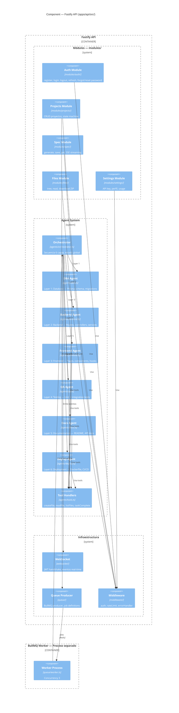

# C4 Component — Fastify API

```mermaid
C4Component
    title Component — Fastify API (apps/api/src/)

    Container_Boundary(api, "Fastify API") {

        Boundary(modules, "Módulos — modules/") {
            Component(auth, "Auth Module", "modules/auth/", "register, login, logout, refresh, forgot/reset password")
            Component(projects, "Projects Module", "modules/projects/", "CRUD proyectos, state machine")
            Component(spec, "Spec Module", "modules/spec/", "generate, save, get, SSE streaming")
            Component(files, "Files Module", "modules/files/", "tree, read, download ZIP")
            Component(settings, "Settings Module", "modules/settings/", "API key, perfil, usage")
        }

        Boundary(agentSystem, "Agent System") {
            Component(orchestrator, "Orchestrator", "agents/orchestrator.ts", "Secuencia 6 capas, estado global")
            Component(dba, "DBA Agent", "agents/dba.ts", "Layer 1: Database — Prisma schema, migrations")
            Component(backendAgent, "Backend Agent", "agents/backend.ts", "Layer 2: Backend — Routes, controllers, services")
            Component(frontendAgent, "Frontend Agent", "agents/frontend.ts", "Layer 3: Frontend — Pages, components, hooks")
            Component(qa, "QA Agent", "agents/qa.ts", "Layer 4: Testing — Unit + integration tests")
            Component(docsAgent, "Docs Agent", "agents/docs.ts", "Layer 5: Documentation — README, API docs")
            Component(deployAgent, "Deploy Agent", "agents/deploy.ts", "Layer 6: Deployment — Dockerfile, CI/CD")
            Component(toolHandlers, "Tool Handlers", "agents/tools.ts", "createFile, readFile, listFiles, taskComplete")
        }

        Boundary(infra, "Infraestructura") {
            Component(ws, "WebSocket", "websocket/", "JWT handshake, eventos real-time")
            Component(queue, "Queue Producer", "queue/", "BullMQ producer, job definitions")
            Component(middleware, "Middleware", "middleware/", "auth, rateLimit, errorHandler")
        }
    }

    Container_Boundary(worker, "BullMQ Worker — Proceso separado") {
        Component(workerProcess, "Worker Process", "queue/worker.ts", "Concurrency 3")
    }

    Rel(auth, middleware, "Usa")
    Rel(projects, middleware, "Usa")
    Rel(spec, middleware, "Usa")
    Rel(files, middleware, "Usa")
    Rel(settings, middleware, "Usa")
    Rel(projects, queue, "Encola generation job")
    Rel(queue, workerProcess, "Jobs", "Redis")
    Rel(workerProcess, orchestrator, "Inicia secuencia")
    Rel(orchestrator, dba, "Layer 1")
    Rel(orchestrator, backendAgent, "Layer 2")
    Rel(orchestrator, frontendAgent, "Layer 3")
    Rel(orchestrator, qa, "Layer 4")
    Rel(orchestrator, docsAgent, "Layer 5")
    Rel(orchestrator, deployAgent, "Layer 6")
    Rel(dba, toolHandlers, "Usa tools")
    Rel(backendAgent, toolHandlers, "Usa tools")
    Rel(frontendAgent, toolHandlers, "Usa tools")
    Rel(qa, toolHandlers, "Usa tools")
    Rel(docsAgent, toolHandlers, "Usa tools")
    Rel(deployAgent, toolHandlers, "Usa tools")
    Rel(orchestrator, ws, "Emite eventos")

    UpdateLayoutConfig($c4ShapeInRow="5", $c4BoundaryInRow="1")
```
