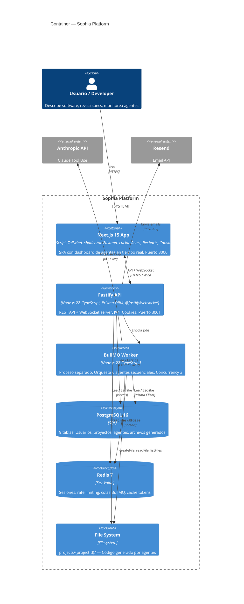

# C4 Container — Sophia Platform

```mermaid
C4Container
    title Container — Sophia Platform

    Person(user, "Usuario / Developer", "Describe software, revisa specs, monitorea agentes")

    System_Boundary(sophia, "Sophia Platform") {
        Container(nextApp, "Next.js 15 App", "TypeScript, Tailwind, shadcn/ui, Zustand, Lucide React, Recharts, Canvas API", "SPA con dashboard de agentes en tiempo real. Puerto 3000")
        Container(fastifyApi, "Fastify API", "Node.js 22, TypeScript, Prisma ORM, @fastify/websocket", "REST API + WebSocket server. JWT Cookies. Puerto 3001")
        Container(bullWorker, "BullMQ Worker", "Node.js 22, TypeScript", "Proceso separado. Orquesta 6 agentes secuenciales. Concurrency 3")
        ContainerDb(pg, "PostgreSQL 16", "SQL", "9 tablas. Usuarios, proyectos, agentes, archivos generados")
        ContainerDb(redis, "Redis 7", "Key-Value", "Sesiones, rate limiting, colas BullMQ, cache tokens")
        Container(fs, "File System", "Filesystem", "projects/{projectId}/ — Código generado por agentes")
    }

    System_Ext(anthropic, "Anthropic API", "Claude Tool Use")
    System_Ext(resend, "Resend", "Email API")

    Rel(user, nextApp, "Usa", "HTTPS")
    BiRel(nextApp, fastifyApi, "API + WebSocket", "HTTPS / WSS")
    Rel(fastifyApi, pg, "Lee / Escribe", "Prisma Client")
    Rel(fastifyApi, redis, "Lee / Escribe", "ioredis")
    Rel(fastifyApi, bullWorker, "Encola jobs")
    Rel(bullWorker, pg, "Lee / Escribe", "Prisma Client")
    Rel(bullWorker, redis, "Lee / Escribe", "ioredis")
    Rel(bullWorker, anthropic, "Tool Use loop", "REST API")
    Rel(bullWorker, fs, "createFile, readFile, listFiles")
    Rel(fastifyApi, fs, "readFile, listFiles")
    Rel(fastifyApi, resend, "Envía emails", "REST API")

    UpdateLayoutConfig($c4ShapeInRow="3", $c4BoundaryInRow="1")
```
