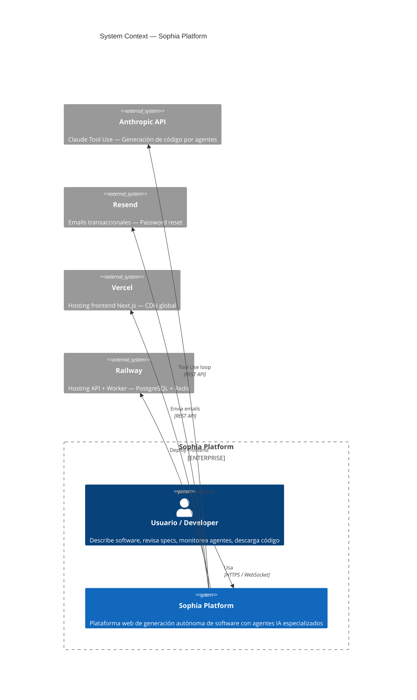

# C4 Context — Sophia Platform

```mermaid
C4Context
    title System Context — Sophia Platform

    Enterprise_Boundary(b0, "Sophia Platform") {
        Person(user, "Usuario / Developer", "Describe software, revisa specs, monitorea agentes, descarga código")
        System(sophia, "Sophia Platform", "Plataforma web de generación autónoma de software con agentes IA especializados")
    }

    System_Ext(anthropic, "Anthropic API", "Claude Tool Use — Generación de código por agentes")
    System_Ext(resend, "Resend", "Emails transaccionales — Password reset")
    System_Ext(vercel, "Vercel", "Hosting frontend Next.js — CDN global")
    System_Ext(railway, "Railway", "Hosting API + Worker — PostgreSQL + Redis")

    Rel(user, sophia, "Usa", "HTTPS / WebSocket")
    Rel(sophia, anthropic, "Tool Use loop", "REST API")
    Rel(sophia, resend, "Envía emails", "REST API")
    Rel(sophia, vercel, "Deploy frontend")
    Rel(sophia, railway, "Deploy backend")

    UpdateLayoutConfig($c4ShapeInRow="3", $c4BoundaryInRow="1")
```
