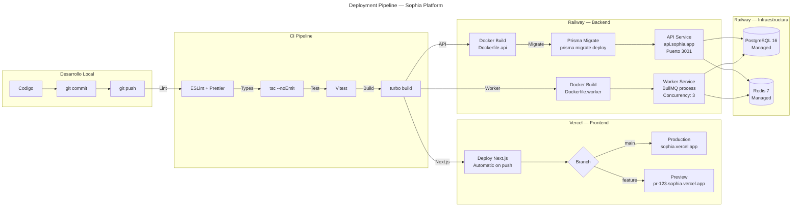

# Deployment Pipeline — Sophia Platform

Pipeline completo desde desarrollo local hasta producción.

## Servicios en producción

| Servicio | Plataforma | URL | Notas |
|----------|-----------|-----|-------|
| Frontend (Next.js 15) | Vercel | sophia.vercel.app | Auto-deploy on push to main |
| API (Fastify) | Railway | api.sophia.app | Dockerfile.api, puerto 3001 |
| Worker (BullMQ) | Railway | — (no HTTP) | Dockerfile.worker, concurrency 3 |
| PostgreSQL 16 | Railway | Internal URL | Managed, daily backups |
| Redis 7 | Railway | Internal URL | Managed, colas + sesiones |
