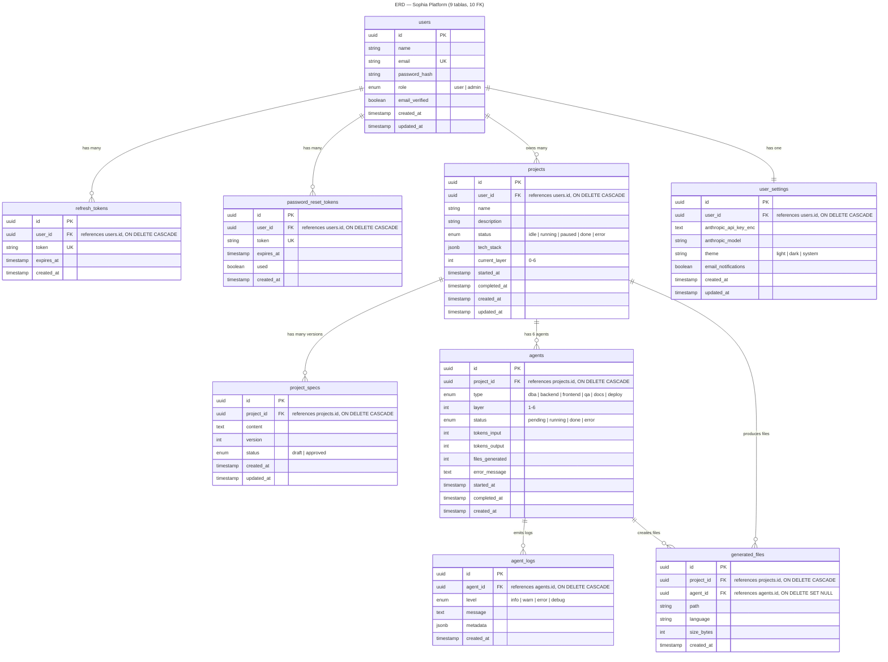

# ERD — Sophia Platform

9 tablas, 10 relaciones FK.

## Relaciones FK

| FK | Desde | Hacia | Cardinalidad | ON DELETE |
|----|-------|-------|--------------|----------|
| 1 | `refresh_tokens.user_id` | `users.id` | N:1 | CASCADE |
| 2 | `password_reset_tokens.user_id` | `users.id` | N:1 | CASCADE |
| 3 | `projects.user_id` | `users.id` | N:1 | CASCADE |
| 4 | `user_settings.user_id` | `users.id` | 1:1 | CASCADE |
| 5 | `project_specs.project_id` | `projects.id` | N:1 | CASCADE |
| 6 | `agents.project_id` | `projects.id` | N:1 | CASCADE |
| 7 | `agent_logs.agent_id` | `agents.id` | N:1 | CASCADE |
| 8 | `generated_files.project_id` | `projects.id` | N:1 | CASCADE |
| 9 | `generated_files.agent_id` | `agents.id` | N:1 | SET NULL |
| 10 | `user_settings.user_id` | `users.id` | 1:1 | CASCADE |
