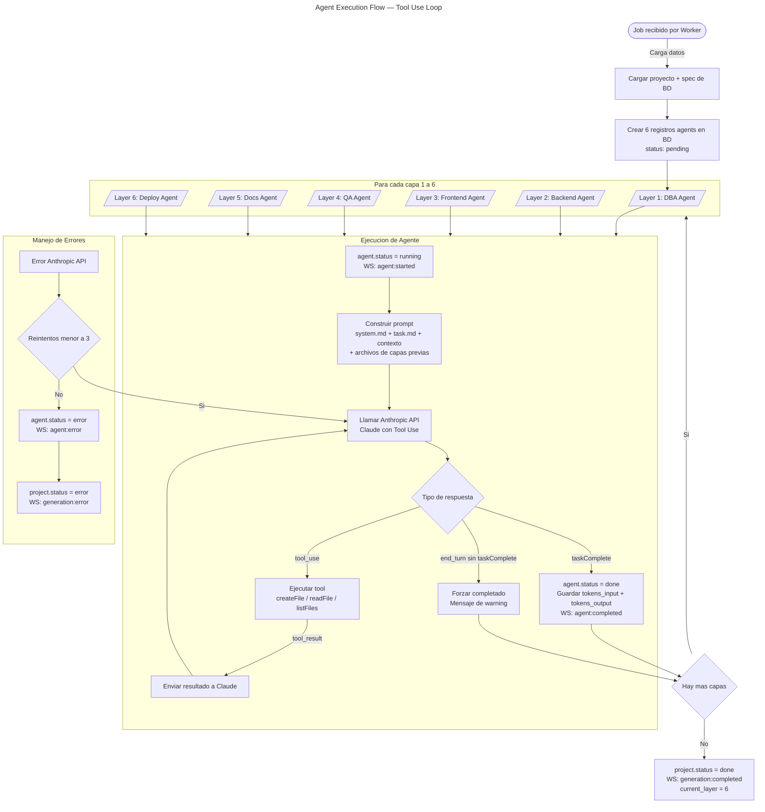

# Agent Execution Flow — Tool Use Loop

Flujo completo desde que BullMQ Worker recibe un job hasta que se completan las 6 capas.

## Herramientas disponibles para agentes

| Tool | Descripción | Parámetros |
|------|-------------|------------|
| `createFile` | Crea/sobrescribe archivo en filesystem | `path`, `content` |
| `readFile` | Lee archivo existente del proyecto | `path` |
| `listFiles` | Lista archivos en directorio | `path` (opcional) |
| `taskComplete` | Señala finalización del agente | `summary` |
