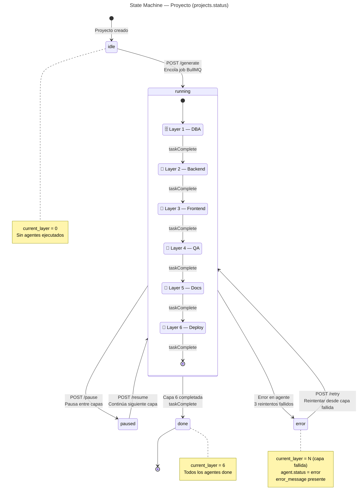

# State Machine — Proyecto

Máquina de estados del campo `projects.status`.

## Transiciones permitidas

| Desde | Hacia | Trigger | Endpoint |
|-------|-------|---------|----------|
| `idle` | `running` | Usuario inicia generación | `POST /projects/:id/generate` |
| `running` | `paused` | Usuario pausa entre capas | `POST /projects/:id/pause` |
| `running` | `done` | Capa 6 completa exitosamente | Automático (Worker) |
| `running` | `error` | Agente falla tras 3 reintentos | Automático (Worker) |
| `paused` | `running` | Usuario reanuda | `POST /projects/:id/resume` |
| `error` | `running` | Usuario reintenta | `POST /projects/:id/retry` |
